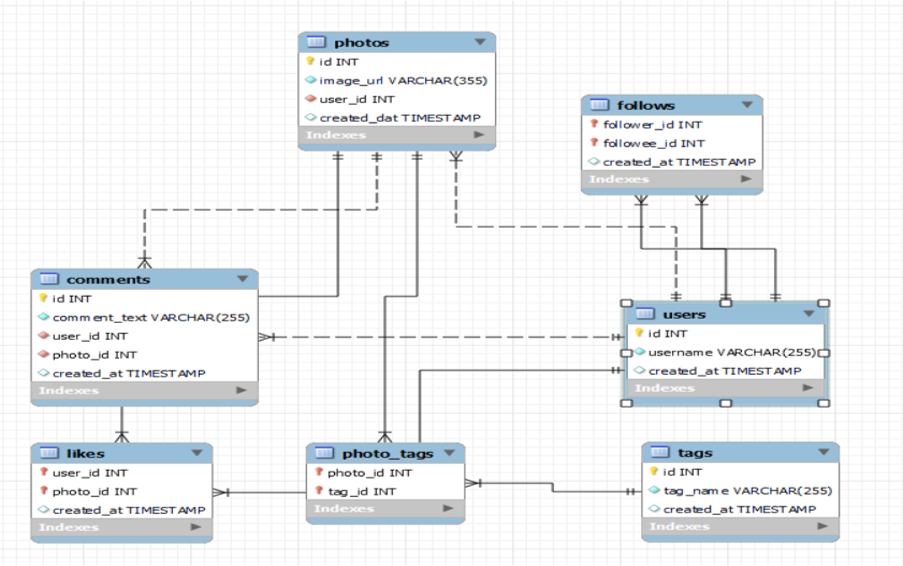
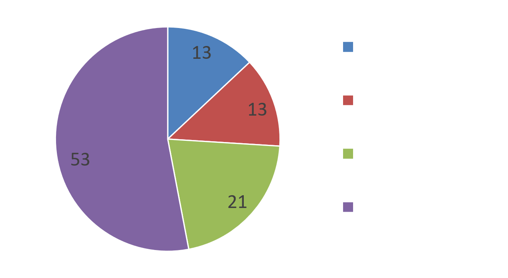
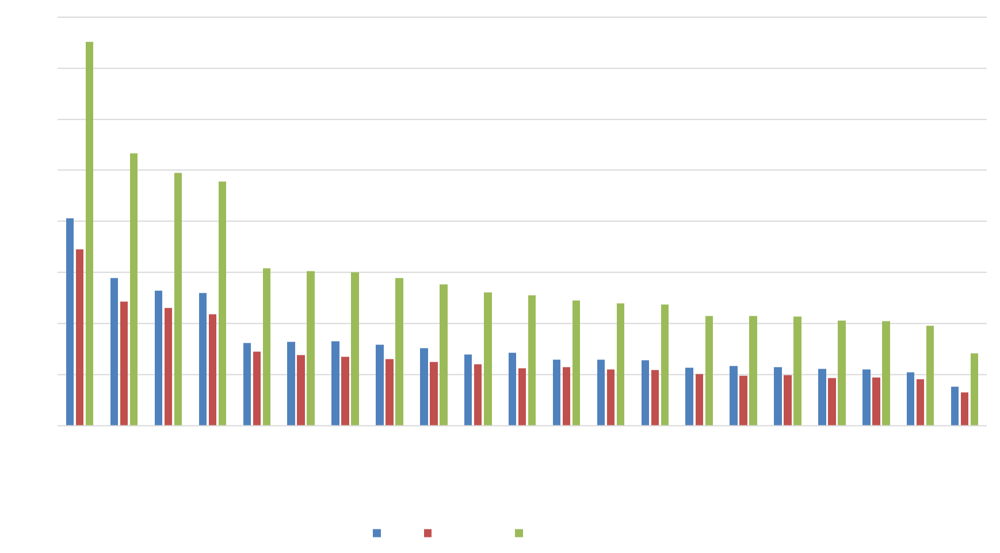
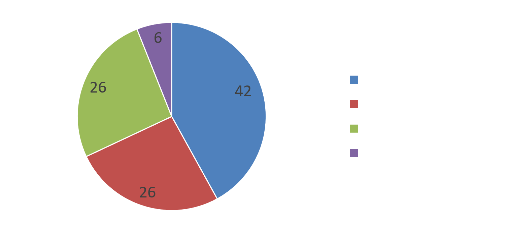
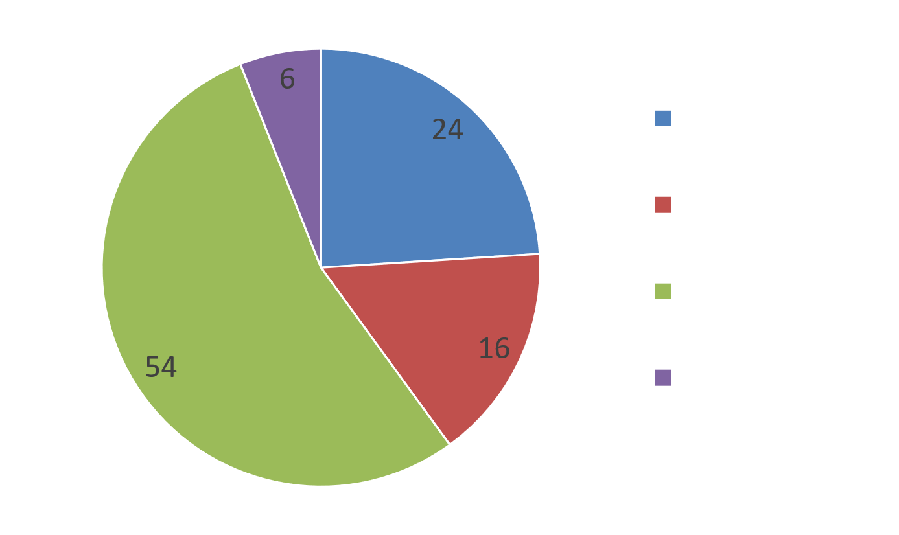

# 📊 Instagram User Engagement Analysis Using SQL

## 📖 Project Overview

This project analyzes an Instagram Clone database to uncover valuable insights into user engagement, content performance, influencer identification, hashtag trends, and user behavior. By solving real-world business problems using SQL, the analysis provides actionable insights that can support data-driven marketing and platform growth strategies.

---

## 🎯 Business Objectives

- Analyze user engagement and activity patterns.
- Identify highly engaged users and potential influencers.
- Evaluate hashtag popularity and content performance.
- Segment users based on engagement levels.
- Generate business recommendations to improve user retention and platform engagement.

---

## 📂 Dataset Overview

The project uses an Instagram Clone relational database consisting of multiple interconnected tables.

### Dataset Statistics

| Metric | Value |
|---------|------:|
| Users | 100 |
| Posts | 257 |
| Likes | 8,782 |
| Comments | 7,488 |
| Hashtags | Multiple |
| Tables | 7 |

---

## 🗄️ Database Schema

The analysis is performed on the following tables:

- Users
- Photos
- Likes
- Comments
- Follows
- Tags
- Photo_Tags

> **ER Diagram**



---

## 🛠️ Tech Stack

- MySQL
- SQL

---

## 📚 SQL Concepts Demonstrated

- Joins
- Common Table Expressions (CTEs)
- Views
- Window Functions
- Aggregate Functions
- CASE Statements
- Subqueries
- Ranking Functions
- GROUP BY & HAVING
- Data Validation

---

## 📌 Business Problems Solved

- Data quality validation
- User activity analysis
- User engagement analysis
- Top influencer identification
- Brand ambassador identification
- Hashtag performance analysis
- Content performance analysis
- User segmentation
- Campaign performance analysis
- Personalized recommendation analysis
- Monthly engagement trend analysis

---

## 📈 Key Insights

- Analyzed engagement data across **100 users, 257 posts, 8,782 likes, and 7,488 comments**.
- Identified highly engaged users suitable for influencer marketing campaigns.
- Evaluated hashtag popularity to understand content trends.
- Segmented users based on engagement levels for targeted marketing.
- Identified inactive users to support re-engagement strategies.

---

## 📷 Project Screenshots

### User Segmentation Analysis



---

### Hashtag Analysis



---

### Influencer Analysis



---

### Brand Ambassador Analysis



---

## 📁 Repository Structure

```text
instagram-user-engagement-analysis/
│
├── README.md
│
├── dataset/
│   └── ig_clone.sql
│
├── sql/
│   └── instagram_analysis.sql
│
├── documentation/
│   └── Instagram_User_Engagement_Report.pdf
│
├── presentation/
│   └── Instagram_User_Engagement_Analysis.pptx
│
└── screenshots/
    ├── er_diagram.png
    ├── brand_ambassador_analysis.png
    ├── hashtag_analysis.png
    ├── influencer_analysis.png
    └── user_segmentation.png
```

---

## 🚀 How to Run

1. Clone this repository.
2. Import the `ig_clone.sql` database into MySQL.
3. Open `instagram_analysis.sql`.
4. Execute the SQL queries sequentially.
5. Review the outputs to explore user engagement insights.

---

## 📌 Future Improvements

- Build an interactive Power BI dashboard.
- Integrate Python for advanced analytics.
- Develop engagement prediction models.
- Automate reporting workflows.

---

## 👨‍💻 Author

**Suman Shakthivel T V**


---
⭐ If you found this project useful, consider giving it a star!
